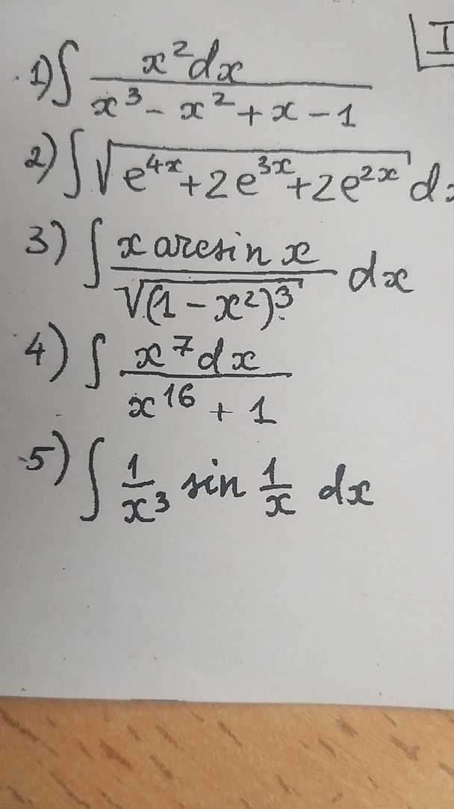
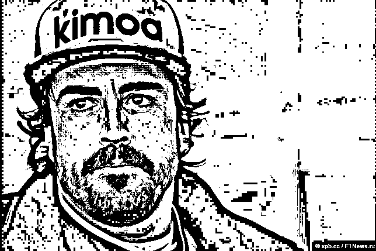

# Лабораторная работа №1. Передискретизация, обесцвечивание и бинаризация растровых изображений

Реализованы:
- Передискретизация методом ближайшего соседа
- Приведение к полутону (формула для Photoshop)
- Бинаризация:
    - Глобальная с заданным порогом
    - Глобальная методом Отсу
    - Адаптивная методом Эйквилла

## Передискретизация изображений
В качестве алгоритма интерполяции и децимации (заполнения "пустых" / удаления "лишних" пикселей) был выбран метод ближайшего соседа
### Растяжение (интерполяция) изображения в M раз

Исходное изображение

Увеличенное в 3 раза изображение

Исходное изображение

Увеличенное в 4 раза изображение

Увеличенное изображение остаётся распознаваемым, а объекты на нём - читаемыми, однако появляются следующие артефакты:
    - вокруг прямых длинных линий появилось "свечение" (звон);
    - гладкие объекты становится "шершавыми", покрываются "лесенками" (пикселизация).
### Сжатие (децимация) изображения в N раз

Исходное изображение

Уменьшенное в 4 раза изображение

Исходное изображение

Уменьшенное в 3 раза изображение

Уменьшенное изображение остаётся распознаваемым, однако появляются следующие артефакты:
    - спираль (уменьшающиеся объекты) плохо конвертируются, появляются видимые артефакты в центре, "рекурсивное закручивание" (эффект Муара);
    - пропадают части объектов.

### Передискретизация в K=M/N раз
#### В два прохода

Исходное изображение

Уменьшенное в 3/4 раза изображение

Исходное изображение

Увеличенное в 4/3 раза изображение

#### В один проход

Исходное изображение

Уменьшенное в 3/4 раза изображение

Исходное изображение

Увеличенное в 4/3 раза изображение

#### Сравнение
В целом, оба метода (в один и два прохода) довольно идентичны, однако можно заметить, что при использовании передискретизации в один проход изображение подвержено меньшей пикселизации, так как появляется меньше "накопленного" дефекта от метода ближайшего соседа.

## Приведение изображения к полутоновому
### Формула Photoshop

Исходное изображение

Приведённое к полутоновому

## Бинаризация изображений
### Метод Эйквила

Исходное изображение

Бинаризированное изображение

Исходное изображение

Бинаризированное изображение

Исходное изображение

Бинаризированное изображение

Исходное изображение

Бинаризированное изображение

### Анализ
Метод Эйквила - метод адаптивной бинаризации изображений, поэтому его преимущества видны при бинаризации картинок, имеющих разный уровень яркости, области тени, а также цветовые неровности (пример - фотография печатного текста).
Метод хорошо выделяет отдельные объекты (контуры лиц, рукописный текст) и обрабатывает мультяшных персонажей (пример - интегралы и шакал). Он может подойти для предварительной обработки изображений с целью дальнейшего анализа объектов.
Большой недостаток метода - создание большого количества "случайного" шума, а также неприспособленность к "краевым ситуациям" (можно наблюдать на бинаризованных изображениях по краям).