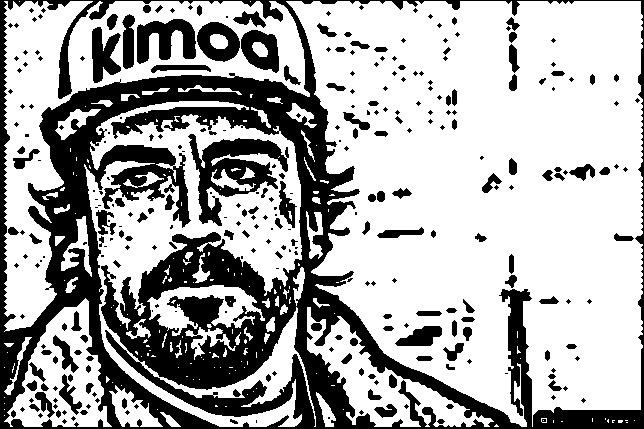
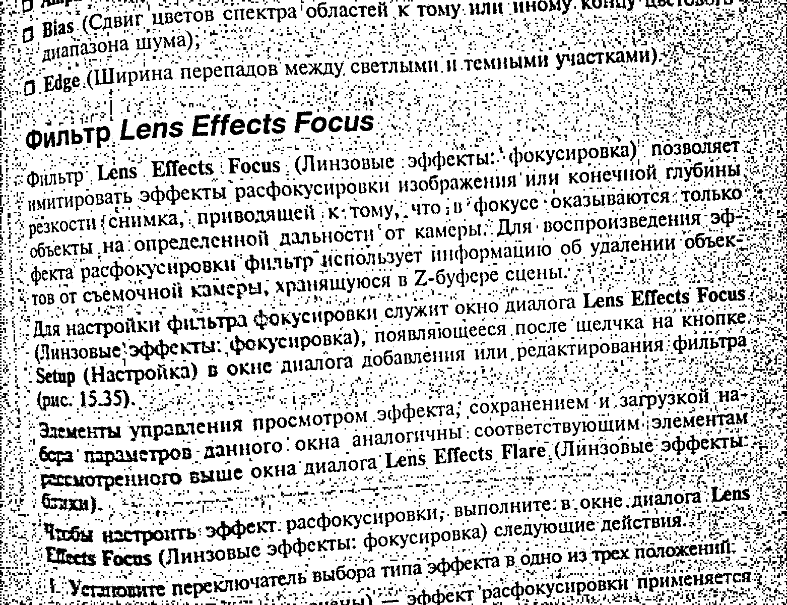

# Лабораторная работа №2. Фильтрация изображений и морфологические операции

Реализован ранговый фильтр с возможностью выбора окна и порога

## Результаты

### Портрет

#### Исходное изображение

#### 1/9

#### 2/9

#### 3/9

#### 4/9

#### 5/9

#### 6/9

#### 7/9

#### 8/9

#### 9/9

### Фотография рукописного текста

#### Исходное изображение

#### 1/9

#### 2/9

#### 3/9

#### 4/9

#### 5/9

#### 6/9

#### 7/9

#### 8/9

#### 9/9

### Фотография печатного текста

#### Исходное изображение

#### 1/9

#### 2/9

#### 3/9

#### 4/9

#### 5/9

#### 6/9

#### 7/9

#### 8/9

#### 9/9

### Вывод
Наилучший результат получается для значений ранга 2 и 3.
В целом, фильтр неплохо справляется с "крупным" шумом, не очень хорошо справляется с "мелким" шумом.
При маленьких значениях происходит высветление исходного изображения, потеря яркости и деталей вместе с шумом.
При больших значениях фильтр начинает создавать дополнительные шумовые вставки, лишь ухудшая исходное изображение.