# Лабораторная работа №3. Выделение контуров на изображении

Реализовано:
    - Выделение контуров оператором Шарра 3х3 с формулой градиента $`G = |G_x| + |G_y|`$

После применения алгоритма выделения контуров изображение бинаризуется в соответствии с заданным порогом (подбирается для каждого изображения экспериментально)

## Результаты работы

### Мультяшное изображение

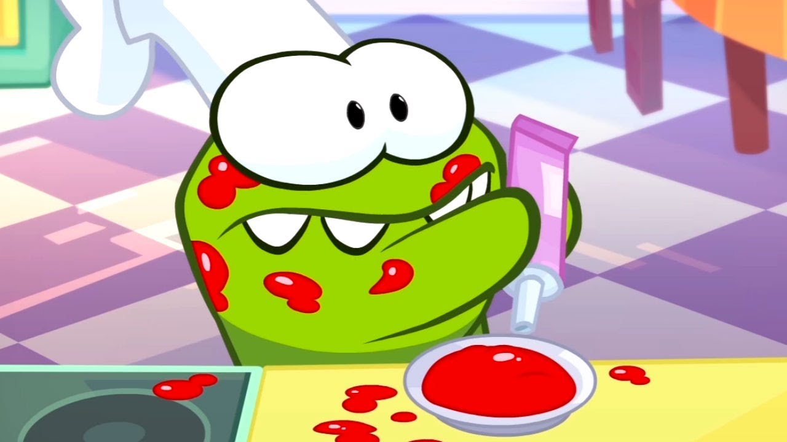
Исходное изображение

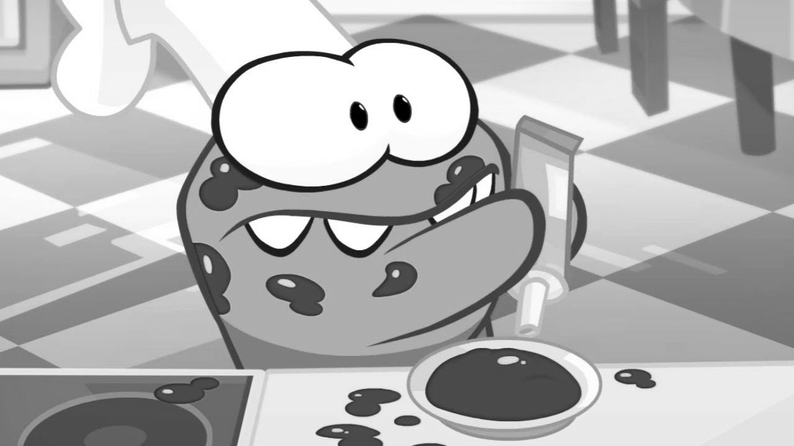
Полутоновое изображение

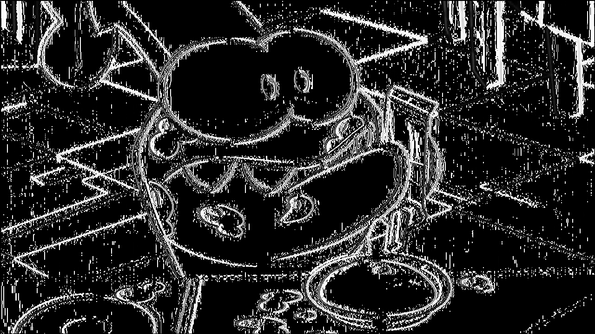
Градиент по X

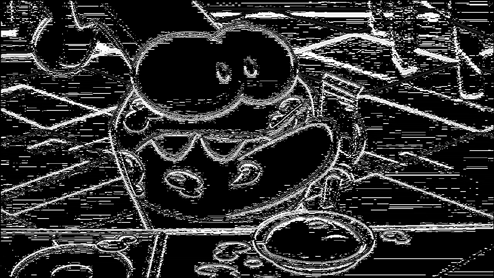
Градиент по Y

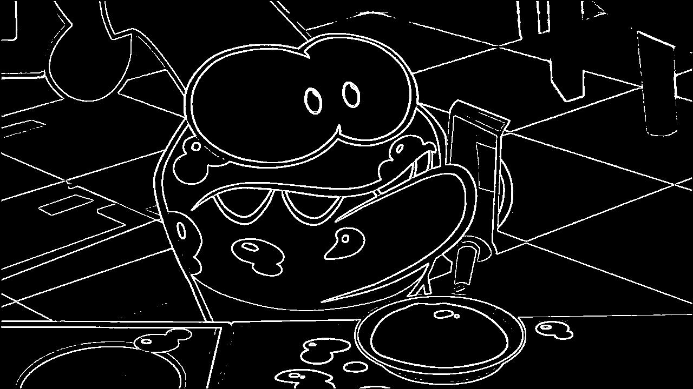
Общий градиент с выделенными контурами (бинаризация Отцу)

#### Вывод: для мультяшного изображения алгоритм работает хорошо, контуры прослеживаются чётко

### Векторное изображение

Исходное изображение

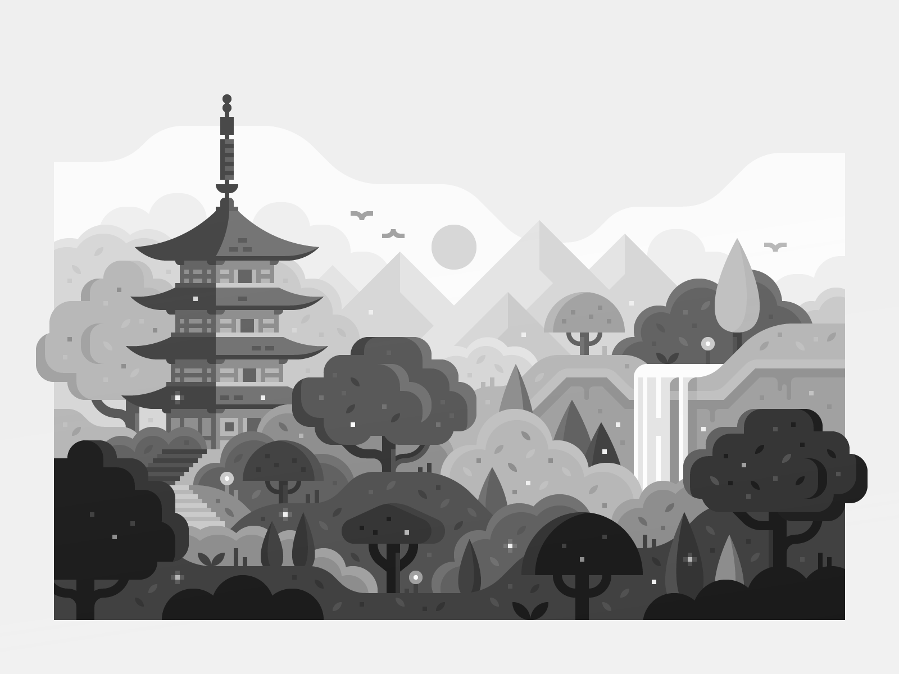
Полутоновое изображение

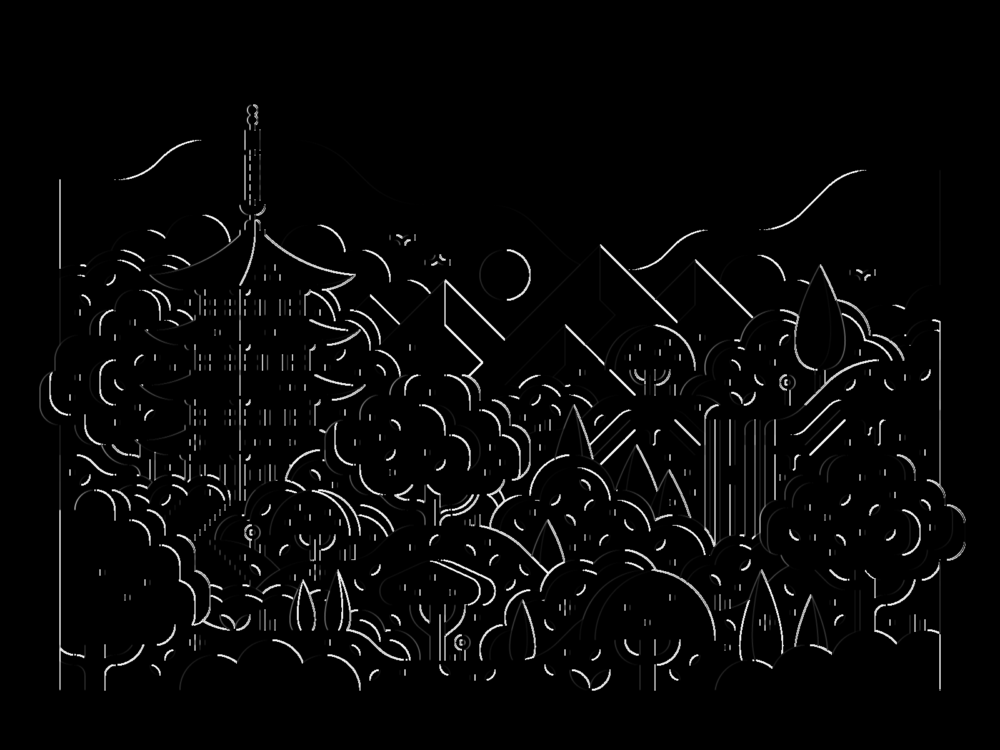
Градиент по X

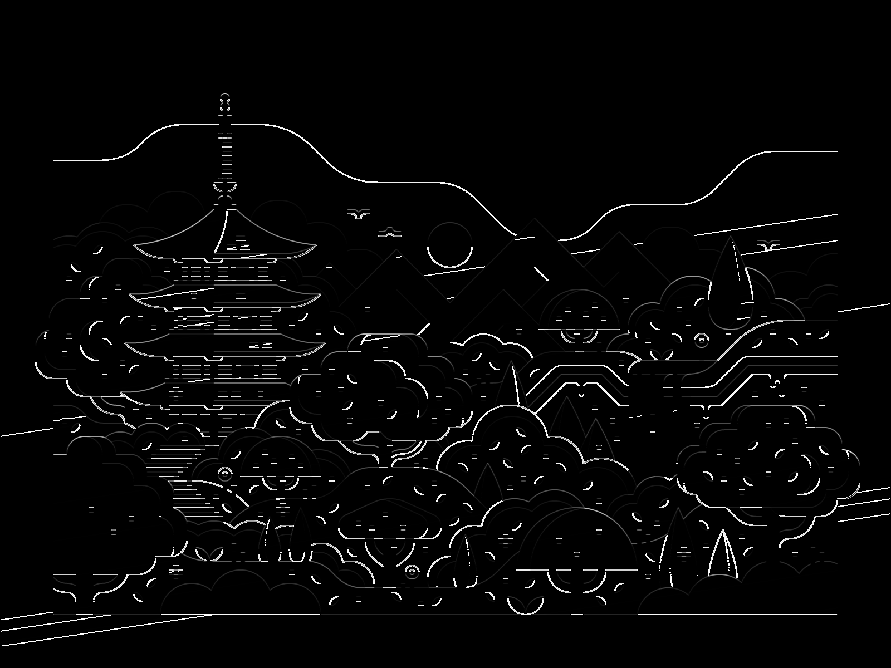
Градиент по Y

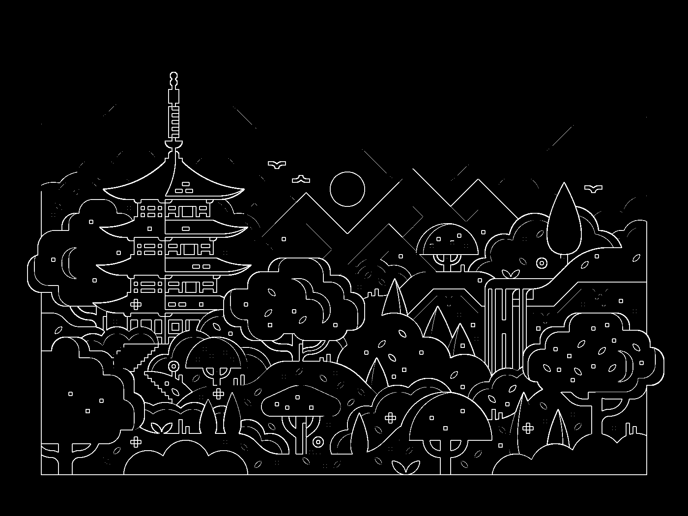
Общий градиент с выделенными контурами (бинаризация Отцу)

#### Вывод: для векторного изображения алгоритм работает хорошо, контуры прослеживаются чётко

### Фотография

Исходное изображение

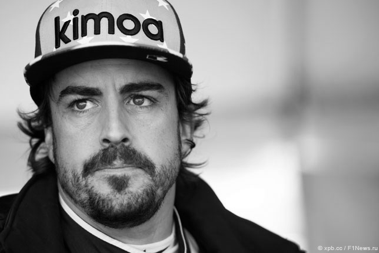
Полутоновое изображение

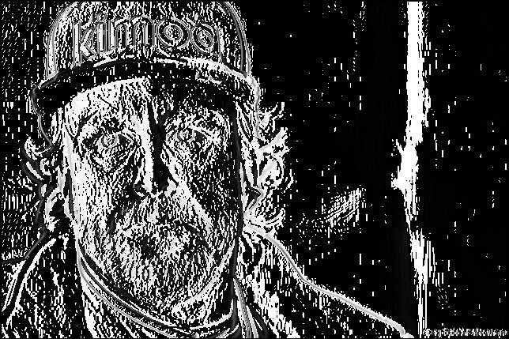
Градиент по X

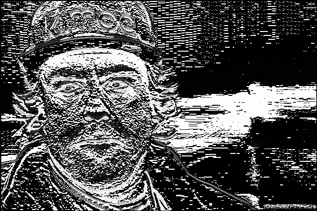
Градиент по Y

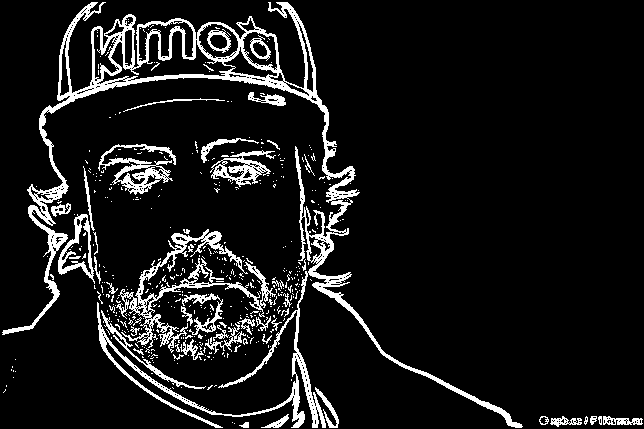
Общий градиент с выделенными контурами (бинаризация Отцу)

#### Вывод: для фотографий такой фильтр работает не сильно хорошо, однако он удаляет лишний шум, прослеживаются главные очертания портрета

### Рукописный текст

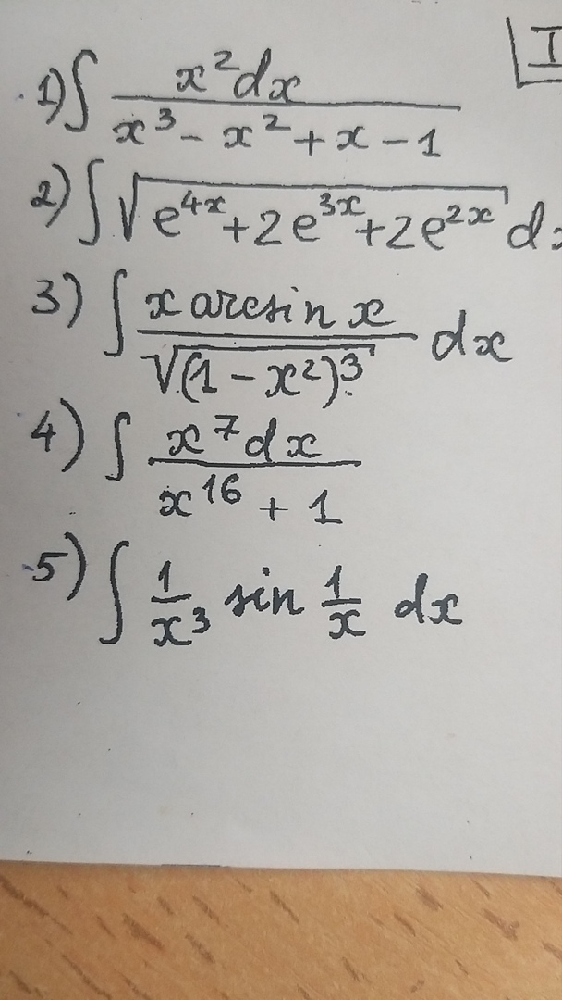
Исходное изображение

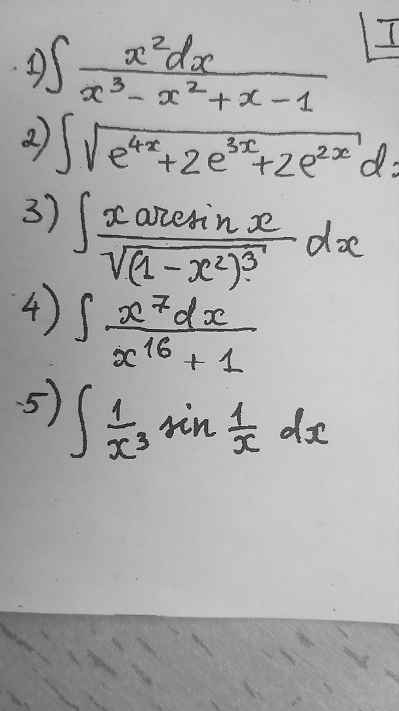
Полутоновое изображение

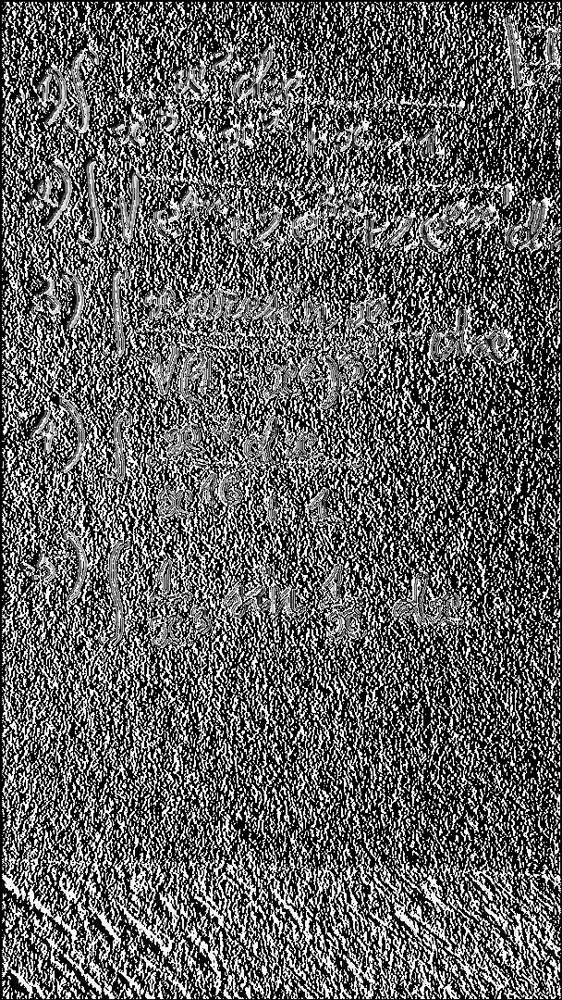
Градиент по X

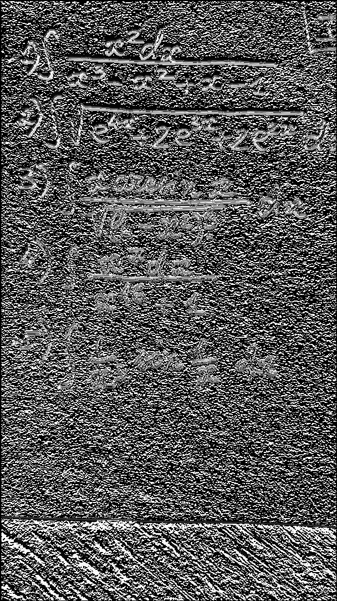
Градиент по Y

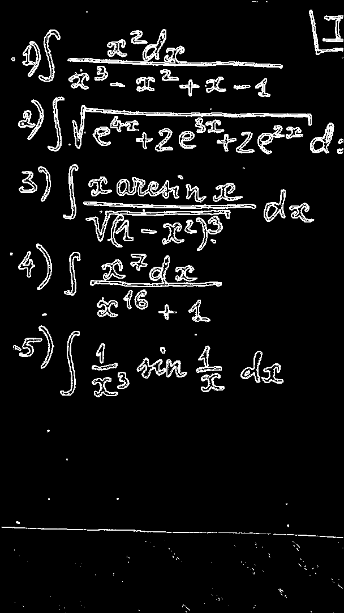
Общий градиент с выделенными контурами (бинаризация Отцу)

#### Вывод: для рукописного текста такой фильтр работает не сильно хорошо, но общие очертания объектов выделяются

## Выводы
Алгоритм выделения контуров оператором Шарра хорошо себя показывает для векторных и мультяшных изображений, но не очень хорошо работает для фотографий с изображениями людей и рукописным текстом

