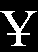
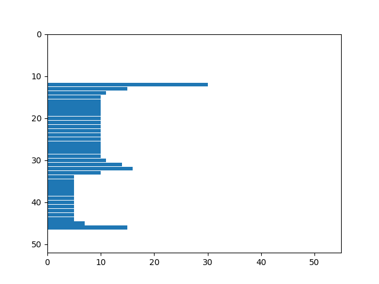

# Лабораторная работа №4. Выделение признаков символов

Лабораторная работа выполнена для:
    - Алфавит - казахский
    - Тип букв - заглавные
    - Шрифт - Times New Roman
    - Размер шрифта - 52

## Профили и числовые признаки изображений

### Буква А

  

Признаки:
- Вес чёрного = 258.0
- Нормированный вес чёрного = 188.53846153846155
- Центр масс = (5330.0, 8337.0)
- Нормированный центр масс = (20.735408560311285, 32.43579766536965)
- Моменты инерции = (17793718083.0, 7272804172.0)
- Нормированные моменты инерции = (4289710.241803279, 1753327.9103182256)

### Буква Ә

  

Признаки:
- Вес чёрного = 353.0
- Нормированный вес чёрного = 251.1730769230769
- Центр масс = (7161.0, 10333.0)
- Нормированный центр масс = (20.34090909090909, 29.352272727272727)
- Моменты инерции = (37476918646.0, 17999437648.0)
- Нормированные моменты инерции = (9201305.830100663, 4419208.850478763)

### Буква Б

  

Признаки:
- Вес чёрного = 355.0
- Нормированный вес чёрного = 204.8076923076923
- Центр масс = (5202.0, 10673.0)
- Нормированный центр масс = (14.692090395480227, 30.146892655367232)
- Моменты инерции = (40211628842.0, 9552558710.0)
- Нормированные моменты инерции = (11157499.678690344, 2650543.4822419533)

### Буква В

  

Признаки:
- Вес чёрного = 427.0
- Нормированный вес чёрного = 287.40384615384613
- Центр масс = (7438.0, 12516.0)
- Нормированный центр масс = (17.45774647887324, 29.377934272300468)
- Моменты инерции = (66576774378.0, 23512795998.0)
- Нормированные моменты инерции = (16944966.75439043, 5984422.498854671)

### Буква Г

  

Признаки:
- Вес чёрного = 236.0
- Нормированный вес чёрного = 140.69230769230768
- Центр масс = (2592.0, 6317.0)
- Нормированный центр масс = (11.025531914893618, 26.876595744680852)
- Моменты инерции = (9337852415.0, 1572156234.0)
- Нормированные моменты инерции = (2547845.133697135, 428964.86603001365)

### Буква Ғ

  

Признаки:
- Вес чёрного = 247.0
- Нормированный вес чёрного = 123.5
- Центр масс = (2811.0, 6646.0)
- Нормированный центр масс = (11.422764227642276, 27.01219512195122)
- Моменты инерции = (10821691102.0, 1935962066.0)
- Нормированные моменты инерции = (3201683.7579881656, 572769.8420118343)

### Буква Д

  

Признаки:
- Вес чёрного = 347.0
- Нормированный вес чёрного = 240.23076923076923
- Центр масс = (7202.0, 11209.0)
- Нормированный центр масс = (20.8121387283237, 32.39306358381503)
- Моменты инерции = (43346803280.0, 17894916166.0)
- Нормированные моменты инерции = (10836700.82, 4473729.0415)

### Буква Е

  

Признаки:
- Вес чёрного = 320.0
- Нормированный вес чёрного = 196.92307692307693
- Центр масс = (4477.0, 9305.0)
- Нормированный центр масс = (14.031347962382446, 29.16614420062696)
- Моменты инерции = (27533716125.0, 6373921539.0)
- Нормированные моменты инерции = (7385653.4670064375, 1709742.9020922747)

### Буква Ё

  

Признаки:
- Вес чёрного = 372.0
- Нормированный вес чёрного = 228.92307692307693
- Центр масс = (5335.0, 9643.0)
- Нормированный центр масс = (14.377358490566039, 25.98921832884097)
- Моменты инерции = (34405672627.0, 10531117865.0)
- Нормированные моменты инерции = (9228989.438572962, 2824870.67194206)

### Буква Ж

  

Признаки:
- Вес чёрного = 493.0
- Нормированный вес чёрного = 445.5961538461538
- Центр масс = (11779.0, 14611.0)
- Нормированный центр масс = (23.9390243902439, 29.695121951219512)
- Моменты инерции = (104819825188.0, 68124055024.0)
- Нормированные моменты инерции = (21335197.47364136, 13866080.810909832)

### Буква З

  

Признаки:
- Вес чёрного = 228.0
- Нормированный вес чёрного = 118.3846153846154
- Центр масс = (3815.0, 6462.0)
- Нормированный центр масс = (16.801762114537446, 28.462555066079297)
- Моменты инерции = (9437392830.0, 3289325489.0)
- Нормированные моменты инерции = (2749022.088552287, 958148.9918438683)

### Буква И

  

Признаки:
- Вес чёрного = 416.0
- Нормированный вес чёрного = 304.0
- Центр масс = (7734.0, 12066.0)
- Нормированный центр масс = (18.633734939759037, 29.072289156626507)
- Моменты инерции = (60273979948.0, 24763495372.0)
- Нормированные моменты инерции = (14530853.410800386, 5969984.419479267)

### Буква Й

  

Признаки:
- Вес чёрного = 476.0
- Нормированный вес чёрного = 347.8461538461538
- Центр масс = (8873.0, 12354.0)
- Нормированный центр масс = (18.677894736842106, 26.006315789473685)
- Моменты инерции = (72342905984.0, 37318291647.0)
- Нормированные моменты инерции = (17440430.56509161, 8996695.18972999)

### Буква К

  

Признаки:
- Вес чёрного = 368.0
- Нормированный вес чёрного = 247.69230769230768
- Центр масс = (5709.0, 10887.0)
- Нормированный центр масс = (15.553133514986376, 29.662125340599456)
- Моменты инерции = (43381165197.0, 11929034603.0)
- Нормированные моменты инерции = (11041273.911173327, 3036150.3189106644)

### Буква Қ

  

Признаки:
- Вес чёрного = 393.0
- Нормированный вес чёрного = 272.0769230769231
- Центр масс = (6497.0, 12062.0)
- Нормированный центр масс = (16.571428571428573, 30.767857142857142)
- Моменты инерции = (56887735064.0, 16504642902.0)
- Нормированные моменты инерции = (14221933.766, 4126160.7255)

### Буква Л

  

Признаки:
- Вес чёрного = 286.0
- Нормированный вес чёрного = 198.0
- Центр масс = (6036.0, 8297.0)
- Нормированный центр масс = (21.17543859649123, 29.108771929824563)
- Моменты инерции = (19550901723.0, 10347204078.0)
- Нормированные моменты инерции = (4887725.43075, 2586801.0195)

### Буква М

  

Признаки:
- Вес чёрного = 479.0
- Нормированный вес чёрного = 432.9423076923077
- Центр масс = (11599.0, 13861.0)
- Нормированный центр масс = (24.263598326359833, 28.99581589958159)
- Моменты инерции = (91645185388.0, 64174412784.0)
- Нормированные моменты инерции = (18653609.88968044, 13062164.214125788)

### Буква Н

  

Признаки:
- Вес чёрного = 381.0
- Нормированный вес чёрного = 278.4230769230769
- Центр масс = (7274.0, 11081.0)
- Нормированный центр масс = (19.139473684210525, 29.157894736842106)
- Моменты инерции = (46537233314.0, 20053476888.0)
- Нормированные моменты инерции = (11219198.002410801, 4834492.981677917)

### Буква Ң

  

Признаки:
- Вес чёрного = 404.0
- Нормированный вес чёрного = 295.2307692307692
- Центр масс = (8060.0, 12202.0)
- Нормированный центр масс = (19.997518610421835, 30.27543424317618)
- Моменты инерции = (59853722600.0, 26115573210.0)
- Нормированные моменты инерции = (14429537.75313404, 6295943.396817744)

### Буква О

  

Признаки:
- Вес чёрного = 344.0
- Нормированный вес чёрного = 251.38461538461536
- Центр масс = (6493.0, 10019.0)
- Нормированный центр масс = (18.927113702623906, 29.206997084548107)
- Моменты инерции = (34330408611.0, 14418562805.0)
- Нормированные моменты инерции = (8276376.232160077, 3476027.6771938284)

### Буква Ө

  

Признаки:
- Вес чёрного = 388.0
- Нормированный вес чёрного = 276.0769230769231
- Центр масс = (7337.0, 11280.0)
- Нормированный центр масс = (18.956072351421188, 29.14470284237726)
- Моменты инерции = (49114383584.0, 20779171811.0)
- Нормированные моменты инерции = (12058527.764301497, 5101687.16204272)

### Буква П

  

Признаки:
- Вес чёрного = 397.0
- Нормированный вес чёрного = 290.11538461538464
- Центр масс = (7352.0, 11218.0)
- Нормированный центр масс = (18.56313131313131, 28.325757575757574)
- Моменты инерции = (49708562938.0, 21350680190.0)
- Нормированные моменты инерции = (11983742.270491803, 5147222.803760849)

### Буква Р

  

Признаки:
- Вес чёрного = 293.0
- Нормированный вес чёрного = 163.40384615384616
- Центр масс = (4103.0, 7675.0)
- Нормированный центр масс = (14.047945205479452, 26.28082191780822)
- Моменты инерции = (17141768610.0, 4898943354.0)
- Нормированные моменты инерции = (4835477.746121298, 1381930.4242595204)

### Буква С

  

Признаки:
- Вес чёрного = 238.0
- Нормированный вес чёрного = 160.19230769230768
- Центр масс = (3133.0, 6720.0)
- Нормированный центр масс = (13.215189873417721, 28.350210970464136)
- Моменты инерции = (10657601476.0, 2316562877.0)
- Нормированные моменты инерции = (2712548.0977347926, 589606.2298294732)

### Буква Т

  

Признаки:
- Вес чёрного = 222.0
- Нормированный вес чёрного = 136.6153846153846
- Центр масс = (3671.0, 5691.0)
- Нормированный центр масс = (16.60633484162896, 25.74660633484163)
- Моменты инерции = (7125424343.0, 2964840643.0)
- Нормированные моменты инерции = (1911326.2722639486, 795289.8720493562)

### Буква У

  

Признаки:
- Вес чёрного = 245.0
- Нормированный вес чёрного = 174.3269230769231
- Центр масс = (4215.0, 6237.0)
- Нормированный центр масс = (17.270491803278688, 25.557377049180328)
- Моменты инерции = (9452926354.0, 4317279830.0)
- Нормированные моменты инерции = (2320875.6086422782, 1059975.4063343972)

### Буква Ұ

  

Признаки:
- Вес чёрного = 303.0
- Нормированный вес чёрного = 221.4230769230769
- Центр масс = (5493.0, 8257.0)
- Нормированный центр масс = (18.185430463576157, 27.337748344370862)
- Моменты инерции = (20521852524.0, 9082203046.0)
- Нормированные моменты инерции = (4947408.9980713595, 2189537.8606557376)

### Буква Ү

  

Признаки:
- Вес чёрного = 269.0
- Нормированный вес чёрного = 196.5769230769231
- Центр масс = (4825.0, 7084.0)
- Нормированный центр масс = (18.0, 26.42910447761194)
- Моменты инерции = (13399095250.0, 6216027300.0)
- Нормированные моменты инерции = (3230254.399710704, 1498560.1012536162)

### Буква Ф

  

Признаки:
- Вес чёрного = 451.0
- Нормированный вес чёрного = 364.2692307692308
- Центр масс = (9501.0, 13162.0)
- Нормированный центр масс = (21.11111111111111, 29.246666666666666)
- Моменты инерции = (77784394176.0, 40531027062.0)
- Нормированные моменты инерции = (17409219.82452999, 9071402.65487914)

### Буква Х

  

Признаки:
- Вес чёрного = 323.0
- Нормированный вес чёрного = 236.03846153846155
- Центр масс = (6312.0, 9315.0)
- Нормированный центр масс = (19.599378881987576, 28.925465838509318)
- Моменты инерции = (27853234808.0, 12789217044.0)
- Нормированные моменты инерции = (6714858.921890068, 3083224.93828351)

### Буква Һ

  

Признаки:
- Вес чёрного = 329.0
- Нормированный вес чёрного = 208.78846153846152
- Центр масс = (4964.0, 10382.0)
- Нормированный центр масс = (15.13109756097561, 31.649390243902438)
- Моменты инерции = (35246356774.0, 8057799512.0)
- Нормированные моменты инерции = (9292474.762457158, 2124386.900079093)

### Буква Ц

  

Признаки:
- Вес чёрного = 420.0
- Нормированный вес чёрного = 306.9230769230769
- Центр масс = (8138.0, 12929.0)
- Нормированный центр масс = (19.420047732696897, 30.85441527446301)
- Моменты инерции = (69872939013.0, 27683109428.0)
- Нормированные моменты инерции = (16844970.832449373, 6673845.088717454)

### Буква Ч

  

Признаки:
- Вес чёрного = 334.0
- Нормированный вес чёрного = 218.3846153846154
- Центр масс = (6406.0, 8765.0)
- Нормированный центр масс = (19.234234234234233, 26.31831831831832)
- Моменты инерции = (25506239859.0, 13624377988.0)
- Нормированные моменты инерции = (6607834.160362694, 3529631.6031088084)

### Буква Ш

  

Признаки:
- Вес чёрного = 571.0
- Нормированный вес чёрного = 581.9807692307692
- Центр масс = (14824.0, 17052.0)
- Нормированный центр масс = (26.00526315789474, 29.9140350877193)
- Моменты инерции = (165449116774.0, 125038811488.0)
- Нормированные моменты инерции = (30010723.158715762, 22680720.385996737)

### Буква Щ

  

Признаки:
- Вес чёрного = 598.0
- Нормированный вес чёрного = 609.5
- Центр масс = (16142.0, 18369.0)
- Нормированный центр масс = (27.036850921273032, 30.76716917922948)
- Моменты инерции = (201103066465.0, 155296812326.0)
- Нормированные моменты инерции = (36477973.2387085, 28169202.30836205)

### Буква Ъ

  

Признаки:
- Вес чёрного = 321.0
- Нормированный вес чёрного = 228.40384615384616
- Центр масс = (6461.0, 9906.0)
- Нормированный центр масс = (20.1875, 30.953125)
- Моменты инерции = (31303443304.0, 13316653544.0)
- Нормированные моменты инерции = (7685598.6506260745, 3269495.1004173825)

### Буква Ы

  

Признаки:
- Вес чёрного = 492.0
- Нормированный вес чёрного = 435.2307692307692
- Центр масс = (10916.0, 15187.0)
- Нормированный центр масс = (22.230142566191446, 30.928716904276985)
- Моменты инерции = (113016560659.0, 58388258764.0)
- Нормированные моменты инерции = (23447419.223858923, 12113746.63153527)

### Буква І

  

Признаки:
- Вес чёрного = 199.0
- Нормированный вес чёрного = 68.88461538461539
- Центр масс = (1791.0, 5771.0)
- Нормированный центр масс = (9.04040404040404, 29.141414141414142)
- Моменты инерции = (6561166890.0, 631930202.0)
- Нормированные моменты инерции = (2166831.8659180976, 208695.57529722588)

### Буква Ь

  

Признаки:
- Вес чёрного = 321.0
- Нормированный вес чёрного = 185.1923076923077
- Центр масс = (4444.0, 10205.0)
- Нормированный центр масс = (13.884375, 31.8875)
- Моменты инерции = (33221664322.0, 6300052166.0)
- Нормированные моменты инерции = (9217997.869589346, 1748072.1881243063)

### Буква Э

  

Признаки:
- Вес чёрного = 267.0
- Нормированный вес чёрного = 179.71153846153848
- Центр масс = (5842.0, 7531.0)
- Нормированный центр масс = (21.958646616541355, 28.30827067669173)
- Моменты инерции = (15029971948.0, 9044322436.0)
- Нормированные моменты инерции = (3825393.7256299313, 2301940.044795113)

### Буква Ю

  

Признаки:
- Вес чёрного = 555.0
- Нормированный вес чёрного = 576.3461538461538
- Центр масс = (13955.0, 16148.0)
- Нормированный центр масс = (25.187725631768952, 29.146209386281587)
- Моменты инерции = (144199648736.0, 107692823026.0)
- Нормированные моменты инерции = (25658300.48683274, 19162424.025978647)

### Буква Я

  

Признаки:
- Вес чёрного = 411.0
- Нормированный вес чёрного = 276.6346153846154
- Центр масс = (8127.0, 11826.0)
- Нормированный центр масс = (19.819512195121952, 28.841463414634145)
- Моменты инерции = (57200786786.0, 27013870584.0)
- Нормированные моменты инерции = (14558612.06057521, 6875507.911427844)
