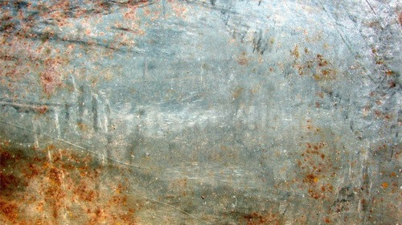
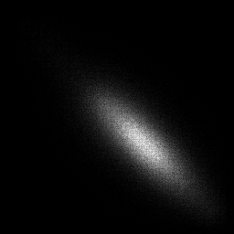
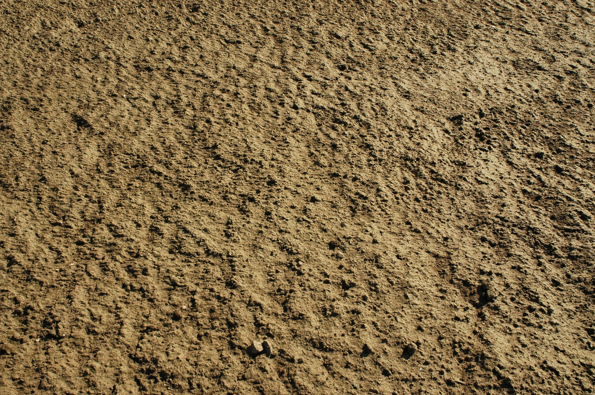
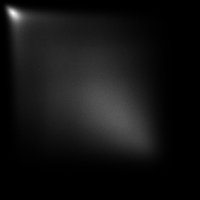
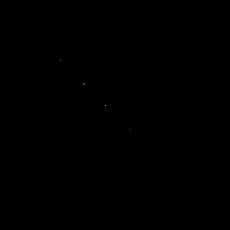

# Лабораторная работа №7. Текстурный анализ

Вариант №6.
Матрица Харалика с d = 3, phi={45, 135, 225, 315}.
Расчёт дисперсии.

### Исходное изображение

Текстура ржавого металла

### Результат

Матрица Харалика:

Дисперсии:
3.7722395543602106e+21, 3.7734213480670256e+21

### Исходное изображение

Текстура земли

### Результат

Матрица Харалика:

Дисперсии:
1.653215554230675e+26, 1.6531370923339847e+26

### Исходное изображение

Текстура земли из Minecraft

### Результат

Матрица Харалика:

Дисперсии:
1.653215554230675e+26, 1.6531370923339847e+26
